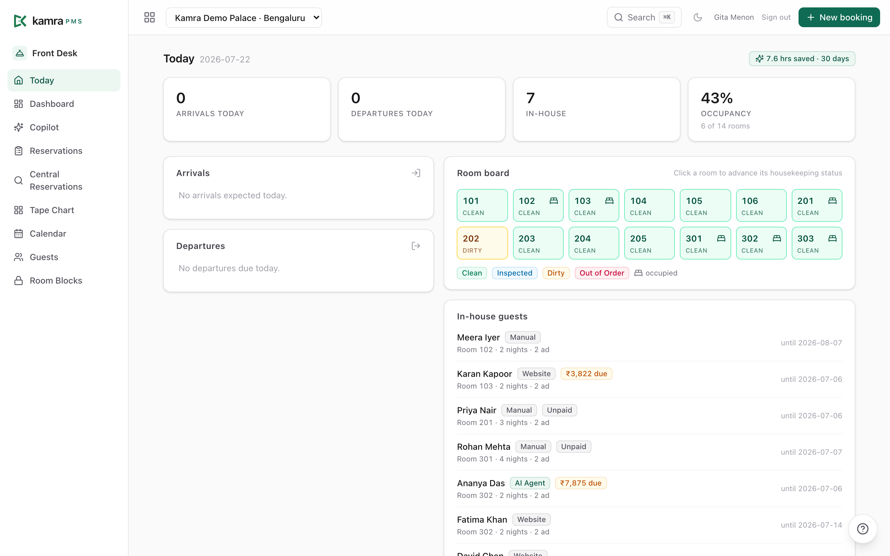
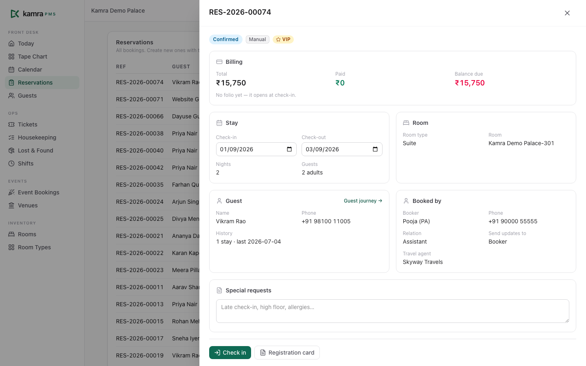
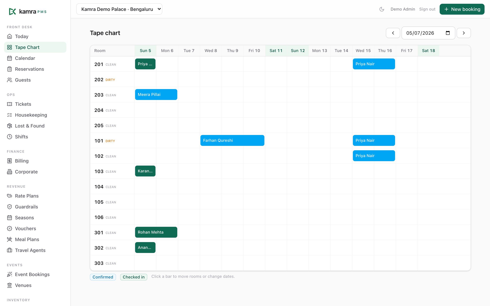
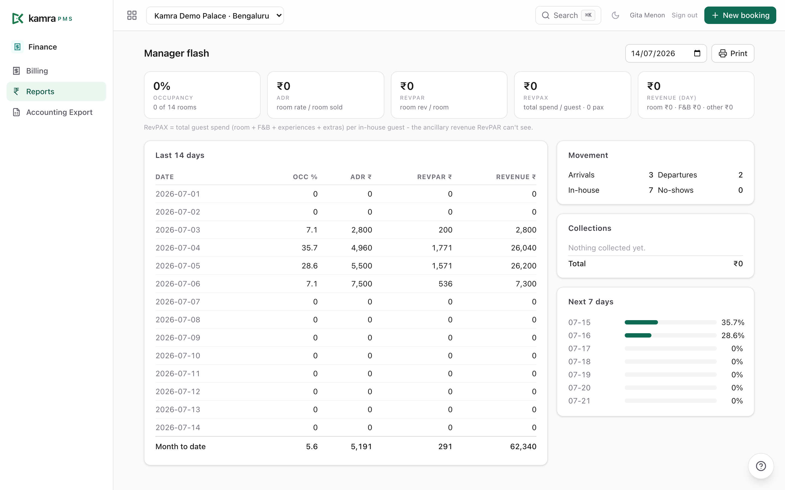
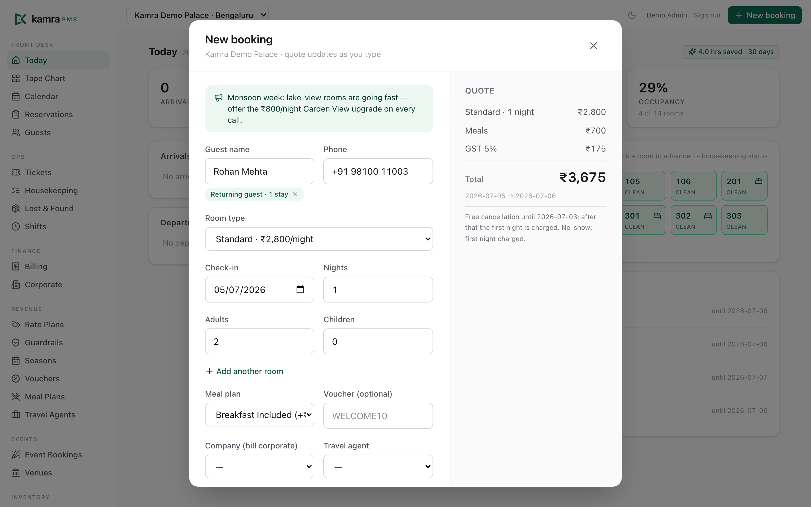
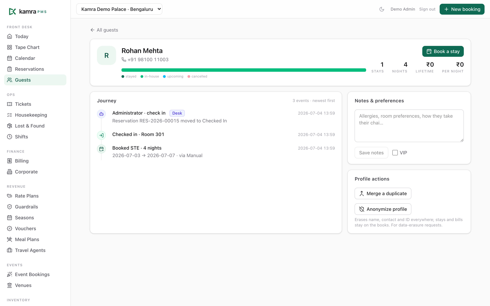
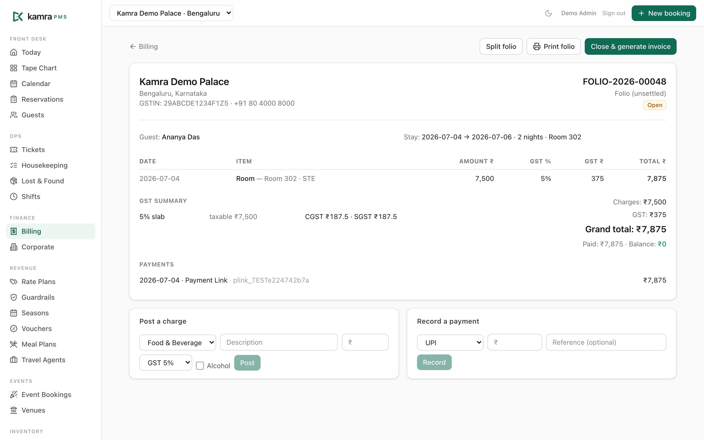
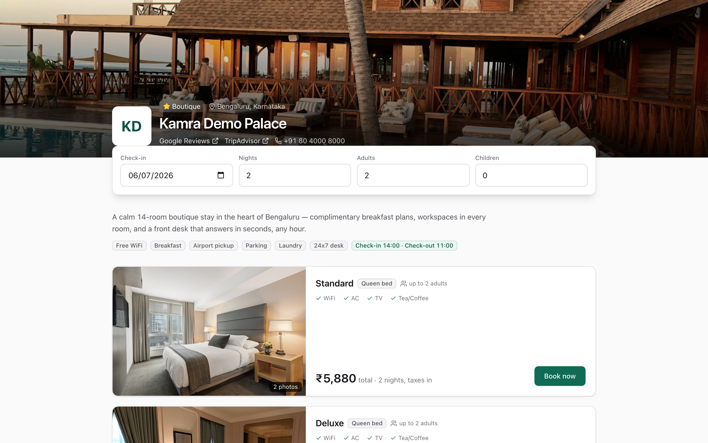

<p align="center">
  
</p>

<h1 align="center">Kamra PMS</h1>
<p align="center"><b>The open-source, agent-ready hotel PMS.</b><br/>
Bring your own AI — Claude over MCP, or HeyKoala for voice/WhatsApp — on infrastructure you own.</p>

<p align="center">
  <a href="https://demo.kamrapms.com"><b>▶ Live demo</b></a> ·
  <a href="https://github.com/Kamra-PMS/kamra-pms/tree/main/docs"><b>Docs</b></a> ·
  <a href="https://github.com/Kamra-PMS/kamra-pms"><b>Source</b></a> ·
  <a href="mailto:hello@kamrapms.com"><b>Contact</b></a>
</p>

> ### 🏨 Try it now → **[demo.kamrapms.com](https://demo.kamrapms.com)**
> A live sandbox pre-loaded with a sample hotel. **Tap any role to sign in — the demo usernames and passwords are listed right on the page.** The guest booking engine is at [/book](https://demo.kamrapms.com/book) and the housekeeping phone app at [/kamra/hk](https://demo.kamrapms.com/kamra/hk).

---

## Why we built this

Most hotel PMS software was built twenty years ago and has barely moved since. Dozens of options, almost no innovation: the same click-heavy screens, the same nightly rituals, the same walls around your own data.

Hotels deserve better than:

- **Per-room, per-module rent.** Your software bill grows every time your hotel does. Night audit is an add-on. Reports are an add-on. The booking engine is an add-on.
- **Your data held hostage.** Guest history, rate history, your books — locked in a vendor's cloud, with an export fee if you ever try to leave.
- **Waiting for AI that never ships.** Legacy vendors bolt a chatbot onto 2005-era software and call it innovation. Real agentic operations need a system *designed* to be operated by AI, not just chatted at.
- **Integration purgatory.** Every connection is a paid interface, a certification queue, a quarter of waiting.
- **Trained-staff-only software.** If a new hire needs a week of training to check someone in, the software failed — not the hire.

**Kamra is the answer we wanted to exist:** a full property management system where every operation — booking, check-in, folios, night audit, pricing — is a governed action, exposed over a real tool layer, so *you* can bring the AI you trust to run it.

## What makes Kamra different

- **Agent-ready, not agent-locked.** Kamra ships an [MCP server](mcp/kamra_mcp.py) with governed tools, role-scoped and permission-checked like any user. Connect Claude (or any MCP client) and say *"book Mr. Rao a deluxe for the weekend with breakfast"* — it quotes, books, and every action is logged. No bundled agent personas to trust or configure — bring your own.
- **Bring your own key.** No bundled AI markup, no model lock-in. Point your own LLM at Kamra's tool surface, or connect [HeyKoala](https://heykoala.ai) for a phone/WhatsApp AI concierge.
- **Deterministic money.** Prices, taxes, availability come from a pricing engine — never from a language model. GST slabs, multi-rate invoices, and the no-overbooking guard are code, verified by an eval suite in CI.
- **Full audit trail.** Every action — human or AI — is logged with who did it, what changed, and why. Accountability comes from the ledger, not from hoping the model behaves.
- **Truly free.** AGPL-licensed. No per-room pricing, no per-user seats, no license audits, no "premium" tiers. Self-host on-prem or on any cloud.
- **Built on Frappe.** The framework behind ERPNext — one of the world's largest open-source ERPs — with its mature ecosystem: RBAC, audit trails, multi-tenancy, the frappe/payments gateway app, and a huge developer community.

## See it

*Screens below are from the [live demo](https://demo.kamrapms.com) — open it and click around.*

| | |
|---|---|
|  |  |
| **Today** — arrivals, departures, in-house with paid/due chips, room board, hours-saved ledger | **Reservation 360** — one panel with live billing, inline date amend, guest journey, and the right check-in/out/cancel actions |
|  |  |
| **Tape chart** — rooms × dates, booking bars, room moves & stay amendments | **Reports** — occupancy/ADR/RevPAR, MTD, collections, 14-day trend, printable flash |
|  |  |
| **New booking** — returning-guest typeahead, live quote, sell message, multi-room, add-ons, cancellation policy in plain words | **Guest profile** — the stay strip, lifetime stats, upcoming stays, merge & anonymize |
|  |  |
| **Folio & GST invoice** — per-line GST, splits/transfers, payment links, multi-rate breakup | **Booking Engine console** — manage your direct-booking page: hotel profile, photo gallery, policies, FAQ, map & directions, and SEO |

**The direct booking page your guests see** — photo gallery, live per-date rates, hotel policies, an FAQ, map & directions, and pay-at-hotel — commission-free, and yours to brand.

[](https://demo.kamrapms.com/book)

## What's inside (today)

| Area | Included |
|---|---|
| Front desk | Today dashboard with paid/due chips, one-click check-in/out, tape chart, reservations, guest **profile hub** (stay strip, merge duplicates, anonymize/DPDP), blacklist |
| Booking Engine | Direct booking page with a **manageable console** — hotel profile, **photo gallery**, policies, **FAQ**, map & driving directions, and **SEO** (meta title/description, OG image); SEO-friendly public page with live rates and pay-at-hotel, commission-free |
| Booking | **Multi-room bookings in one flow**, group & corporate bookings, booked-on-behalf (booker vs guest), returning-guest typeahead, **add-ons at booking**, sell messages, travel agents with commissions, day-use |
| Revenue | Occupancy-based pricing, seasons, rate plans, vouchers, meal plans, **rate guardrails**, cancellation/no-show/deposit **policies enforced in code**, owner-briefing API |
| Billing | Folios with per-line GST (₹7,500 slab auto-switch), **corporate billing rules** (charge routing, alcohol always to guest), **group master folios**, %/₹ **charge splits** with exact conservation, bulk transfers, automated night audit that also charges no-shows, GST invoices with B2B GSTIN, GSTR-1 export, cashier reconciliation, payment links via frappe/payments |
| Operations | Service tickets with SLA, housekeeping **mobile app** (`/hk`), lost & found, shift handover, POS-lite (outlets/menu/orders → folio, alcohol-aware), venues & events |
| Guests | Self check-in links, printable **GRC with the legal occupant register**, ID retention modes (store / verify-and-discard), experiences showcase |
| Platform | Multi-property with per-user scoping, six-role RBAC, settings hub, **dark mode**, onboarding wizard + **AI migration tools**, savings ledger, **18-check eval harness in CI** |

## Documentation

Full docs live in [`docs/`](docs/):

- [Front-desk user guide](docs/user-guide.md) — a day at the desk, end to end
- [AI & API setup](docs/ai-and-api.md) — the BYOK copilot, MCP, API keys, REST
- [Self-hosting guide & prerequisites](docs/self-hosting.md)
- [Email setup](docs/email-setup.md)
- [Developer notes](docs-dev.md) · [Brand assets](branding/README.md)

## Install

```bash
bench get-app payments
bench get-app kamra https://github.com/Kamra-PMS/kamra-pms --branch main
bench --site your-site install-app kamra
```

Kamra ships its built front-end, so after install the product UI is live at
**`/kamra`** (the booking engine redirects in at `/book`, housekeeping at
`/hk`) — no Node server in production. The Frappe Desk stays available at
`/app` as an admin escape hatch. A fresh install creates its own roles and
permissions; sign in as your Administrator and open `/kamra/setup` to create
your property, then add staff users.

### Compatibility & channels

| Kamra | Frappe | Channel |
|---|---|---|
| `main` releases (`vX.Y.Z`) | v16 | **stable** — Frappe Cloud Marketplace, `ghcr.io/kamra-pms/kamra:latest`, [demo.kamrapms.com](https://demo.kamrapms.com) |
| `develop` | v16 | **nightly** — `ghcr.io/kamra-pms/kamra:nightly`, rebuilt every night |

`develop` is the repo's default branch (for contributors), so production
installs should keep the explicit `--branch main`. Releases follow
[SemVer](https://semver.org/); see [`RELEASING.md`](RELEASING.md).

## Quickstart (development)

```bash
bench init --frappe-branch v16.25.0 frappe-bench && cd frappe-bench
bench get-app payments
bench get-app kamra https://github.com/Kamra-PMS/kamra-pms
bench new-site kamra.localhost --admin-password admin
bench --site kamra.localhost install-app kamra
bench serve --port 8000
cd apps/kamra/frontend && npm install && npm run dev   # hot-reload UI on :5173
```

Rebuild the production UI after front-end changes with `npm run build` at the
app root (emits into `kamra/public/frontend`, served at `/kamra`). Seed a demo
property, roles and users via `bench --site … execute kamra.scripts.seed_demo.execute`
(this also enables the demo-account buttons on the login screen). Full dev
notes: [docs-dev.md](docs-dev.md).

Connect an AI agent:

```bash
claude mcp add kamra -e KAMRA_URL=... -e KAMRA_API_KEY=... \
  -e KAMRA_API_SECRET=... -- python mcp/kamra_mcp.py
```

## For hotel owners

You own the software, the server, and every byte of your data. Costs don't scale with your room count. Connect your own AI and it works from day one — and if you ever want managed hosting or an AI concierge (voice, WhatsApp) on top, those are choices, not ransoms.

## For IT teams

Standard Python (Frappe) + React. Real RBAC, real audit trails, documented REST + MCP surfaces, an eval suite in CI, no black boxes. Fork it, extend it, ship your own modules — that's the point.

## License

AGPL-3.0 — free forever. Anyone offering Kamra as a hosted service must share their modifications back, which keeps the ecosystem honest.

## Links & contact

- **Live demo:** [demo.kamrapms.com](https://demo.kamrapms.com) — credentials are on the page
- **Documentation:** [`docs/`](docs/)
- **Source & issues:** [github.com/Kamra-PMS/kamra-pms](https://github.com/Kamra-PMS/kamra-pms)
- **Email:** [hello@kamrapms.com](mailto:hello@kamrapms.com)

Built by [HeyKoala](https://heykoala.ai).

---

*Kamra means "room". The door in our logo is open on purpose.*
