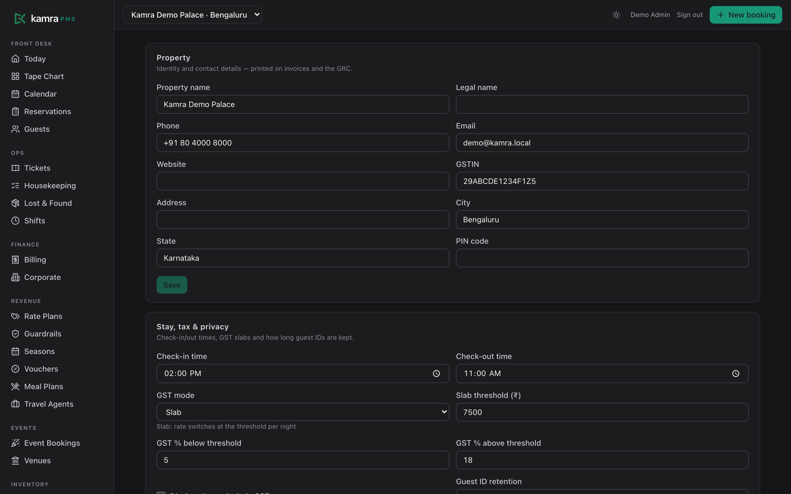

<p align="center">
  
</p>

<h1 align="center">Kamra PMS</h1>
<p align="center"><b>The open-source, AI-native hotel PMS.</b><br/>
Run your hotel with AI agents you control — on infrastructure you own.</p>

---

## Why we built this

Most hotel PMS software was built twenty years ago and has barely moved since. Dozens of options, almost no innovation: the same click-heavy screens, the same nightly rituals, the same walls around your own data.

Hotels deserve better than:

- **Per-room, per-module rent.** Your software bill grows every time your hotel does. Night audit is an add-on. Reports are an add-on. The booking engine is an add-on.
- **Your data held hostage.** Guest history, rate history, your books — locked in a vendor's cloud, with an export fee if you ever try to leave.
- **Waiting for AI that never ships.** Legacy vendors bolt a chatbot onto 2005-era software and call it innovation. Real agentic operations need a system *designed* for agents.
- **Integration purgatory.** Every connection is a paid interface, a certification queue, a quarter of waiting.
- **Trained-staff-only software.** If a new hire needs a week of training to check someone in, the software failed — not the hire.

**Kamra is the answer we wanted to exist:** a full property management system where every operation — booking, check-in, folios, night audit, pricing — is a governed action an AI agent can perform, with the owner's guardrails enforced by the system, not by hope.

## What makes Kamra different

- **AI & agent native, MCP-first.** Kamra ships an [MCP server](mcp/kamra_mcp.py) with 17+ tools. Connect Claude (or any MCP client) and say *"book Mr. Rao a deluxe for the weekend with breakfast"* — the agent quotes, books, and logs it. Agents are just users: role-scoped, permission-checked, fully audited.
- **Bring your own key.** No bundled AI markup, no model lock-in. Point your own LLM at Kamra's tool surface.
- **Deterministic money.** Prices, taxes, availability come from a pricing engine — never from a language model. GST slabs, multi-rate invoices, and the no-overbooking guard are code, verified by an eval suite in CI.
- **Autonomy with rails.** Owners set rate floors/ceilings and approval thresholds; agents literally cannot price outside them. Every automated action records the minutes it saved — ROI is a dashboard, not a promise.
- **Truly free.** AGPL-licensed. No per-room pricing, no per-user seats, no license audits. Self-host on-prem or on any cloud.
- **Built on Frappe.** The framework behind ERPNext — one of the world's largest open-source ERPs — with its mature ecosystem: RBAC, audit trails, multi-tenancy, the frappe/payments gateway app, and a huge developer community.

## See it

| | |
|---|---|
|  |  |
| **Today** — arrivals, departures, in-house with paid/due chips, room board, hours-saved ledger | **Tape chart** — rooms × dates, booking bars, room moves & stay amendments |
|  |  |
| **New booking** — returning-guest typeahead, live quote, sell message, multi-room, add-ons, cancellation policy in plain words | **Guest profile** — the stay strip, lifetime stats, upcoming stays, merge & anonymize |
|  |  |
| **Folio & GST invoice** — per-line GST, splits/transfers, payment links, multi-rate breakup | **Public booking page** — SEO-friendly, live rates, pay-at-hotel, zero commission |
|  | |
| **Settings hub** (dark mode) — GST slabs, ID retention, policies, payments, MCP agent access | |

## What's inside (today)

| Area | Included |
|---|---|
| Front desk | Today dashboard with paid/due chips, one-click check-in/out, tape chart, reservations, guest **profile hub** (stay strip, merge duplicates, anonymize/DPDP), blacklist |
| Booking | Public SEO-friendly booking engine, **multi-room bookings in one flow**, group & corporate bookings, booked-on-behalf (booker vs guest), returning-guest typeahead, **add-ons at booking**, sell messages, travel agents with commissions, day-use |
| Revenue | Occupancy-based pricing, seasons, rate plans, vouchers, meal plans, **rate guardrails**, cancellation/no-show/deposit **policies enforced in code**, owner-briefing API |
| Billing | Folios with per-line GST (₹7,500 slab auto-switch), **corporate billing rules** (charge routing, alcohol always to guest), **group master folios**, %/₹ **charge splits** with exact conservation, bulk transfers, automated night audit that also charges no-shows, GST invoices with B2B GSTIN, GSTR-1 export, cashier reconciliation, payment links via frappe/payments |
| Operations | Service tickets with SLA, housekeeping **mobile app** (`/hk`), lost & found, shift handover, POS-lite (outlets/menu/orders → folio, alcohol-aware), venues & events |
| Guests | Self check-in links, printable **GRC with the legal occupant register**, ID retention modes (store / verify-and-discard), experiences showcase |
| Platform | Multi-property with per-user scoping, six-role RBAC, settings hub, **dark mode**, onboarding wizard + **AI migration tools**, savings ledger, **18-check eval harness in CI** |

## Documentation

- [Self-hosting guide & prerequisites](docs/self-hosting.md)
- [Email setup](docs/email-setup.md)
- [Listing on the Frappe Cloud Marketplace](docs/frappe-marketplace.md)
- [Developer notes](docs-dev.md) · [Brand assets](branding/README.md)

## Quickstart (development)

```bash
bench init --frappe-branch v16.25.0 frappe-bench && cd frappe-bench
bench get-app payments
bench get-app kamra https://github.com/Kamra-PMS/pms
bench new-site kamra.localhost --admin-password admin
bench --site kamra.localhost install-app kamra
bench serve --port 8000
cd apps/kamra/frontend && npm install && npm run dev   # UI on :5173
```

Seed demo data, roles and users: see `kamra/scripts/` (run via `bench console`). Full dev notes: [docs-dev.md](docs-dev.md).

Connect an AI agent:

```bash
claude mcp add kamra -e KAMRA_URL=... -e KAMRA_API_KEY=... \
  -e KAMRA_API_SECRET=... -- python mcp/kamra_mcp.py
```

## For hotel owners

You own the software, the server, and every byte of your data. Costs don't scale with your room count. Your AI front desk works from day one — and if you ever want managed hosting or AI staff (voice, WhatsApp) on top, those are choices, not ransoms.

## For IT teams

Standard Python (Frappe) + React. Real RBAC, real audit trails, documented REST + MCP surfaces, an eval suite in CI, no black boxes. Fork it, extend it, ship your own modules — that's the point.

## License

AGPL-3.0 — free forever. Anyone offering Kamra as a hosted service must share their modifications back, which keeps the ecosystem honest.

---

*Kamra means "room". The door in our logo is open on purpose.*
